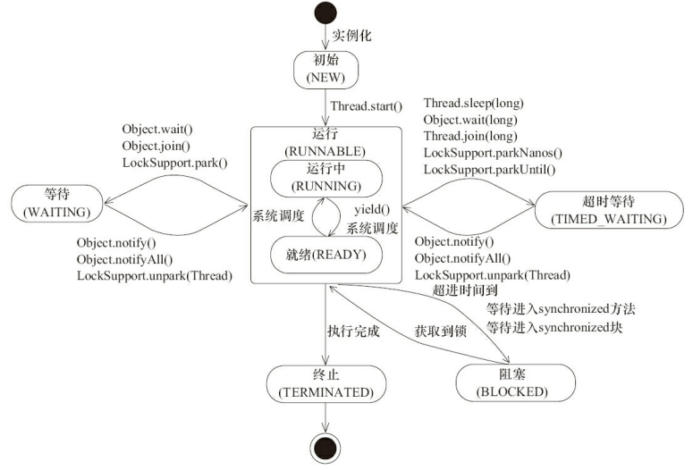
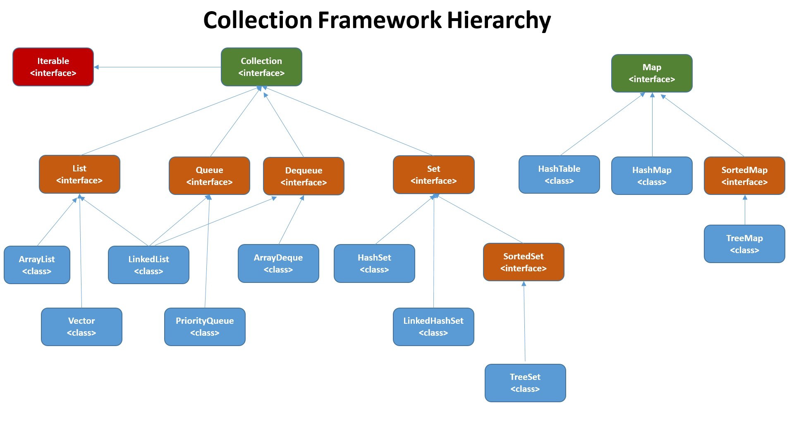
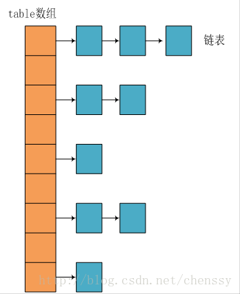
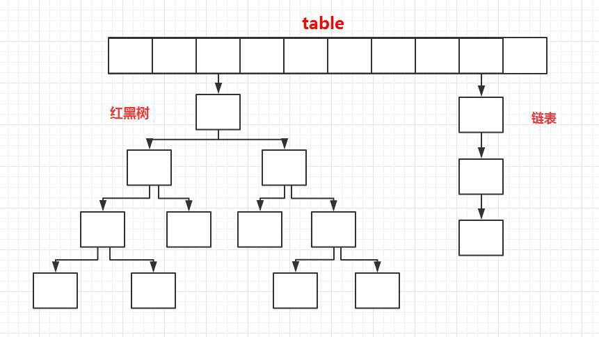

## 介绍一下Java泛型？什么是类型擦除？介绍一下常用的通配符？
* Java泛型是JDK5引入的一个新特性，泛型提供了编译时类型安全检测机制，该机制允许程序员在编译时检测到非法的类型。泛型的本质是参数化类型，也就是说所操作的数据类型被指定为一个参数。
* Java的泛型是伪泛型，这是因为Java在编译期间，所有的泛型信心都会被擦掉，这就是通常所说的类型擦除。
* 泛型一般有三种使用方式：泛型类、泛型接口、泛型方法
1. 泛型类
```java
// 此处T可以随便写为任意标识，常见的如T、E、K、V等形式的参数常用于表示泛型
// 在实例化泛型类时，必须指定T的具体类型
public class Generic<T> {
    private T key;
    
    public Generic(T key) {
        this.key = key;
    }

    public T getKey() {
        return key;
    }
}
```
如何实例化泛型类：
```java
Generic<Integer> genericInteger = new Generic<Integer>(123456);
```
2. 泛型接口
```java
public interface Generator<T> {
    public T method();
}
```
实现泛型接口，不指定类型
```java
class GeneratorImpl<T> implements Generator<T> {
    @Overide
    public T method() {
        return null;
    }
}
```
实现泛型接口，指定类型
```java
class GeneratorImpl<T> implements Generator<String> {
    @Overide
    public String method() {
        return "hello";
    }
}
```
3. 泛型方法
```java
public static <E> void printArray(E[] inputArray) {
    for (E element : inputArray) {
        System.out.printf("%s", element);
    }
}
```
使用:
```java
// 创建不同类型数组：Integer, Double和Character
Integer[] intArray = {1, 2, 3};
String[] stringArray = {"Hello", "World"};
printArray(intArray);
printArray(stringArray);
```
* 常用的通配符：T, E, K, V, ?
    * ?: 表示不确定的java类型
    * T(type): 表示具体的一个java类型
    * K V (key value) 分别代表java键值中的Key Value
    * E(element)代表Element

## ==和equals的区别
* ==: 判断两个对象的地址是不是相等。即判断两个对象是不是同一个对象。
    * 基本数据类型==比较的是值，引用数据类型==比较的是内存地址
    * 因为Java只有值传递，所以，对于==来说，不管是比较基本数据类型，还是引用数据类型的变量，其本质比较的都是值，只是引用类型变量存的值是对象的地址
* equals(): 判断两个对象是否相等看，它不能用于比较基本数据类型的变量。
    * 类没有覆盖equals()方法：则通过equals()比较该类的两个对象时，等价于通过"=="比较两个对象，使用的是默认的Object类的equals()方法
    * 类覆盖了equals()方法.若它们的内容相等，则俩个对象相等
```java
    public class test1 {
        public static void main(String[] args) {
            String a = new String("ab"); // a 为⼀个引⽤
            String b = new String("ab"); // b为另⼀个引⽤,对象的内容⼀样
            String aa = "ab"; // 放在常量池中
            String bb = "ab"; // 从常量池中查找
            if (aa == bb) // true
                System.out.println("aa==bb");
            if (a == b) // false，⾮同⼀对象
                System.out.println("a==b");
            if (a.equals(b)) // true
                System.out.println("aEQb");
            if (42 == 42.0) { // true
                System.out.println("true");
            }
        }
    }
```
## hashCode()与equals()
1. hashCode()介绍
* 返回一个int整数用于确定该对象在哈希表中的索引位置。
* hashCode()定义在JDK的Object类中，这就意味着Java中的任何类都包含有hashCode()函数
2. 为什么要有hashCode()?
* 当你把对象加入到HashSet时，HashSet会先计算对象的hashCode来判断对象加入的位置，同时也会与其它已经加入的对象的hashCode值作比较，如果没有相符的hashCode，HashSet会假设对象没有重复出现。但是如果发现有相同hashcode值的对象，这时会调用equals()方法来检查hashcode相等的对象是否真的相同。如果两者相同，HashSet就不会绕过其加入操作成功。如果不同的话，就会重新散列到其他位置，这样就大大减少了euqals的次数，相应就大大提高了执行速度
3. 为什么重写equals时必须重写hashCode方法？
* 如果两个对象相等，则hashCode一定也是相同的。
    * hashCode()的默认行为是对堆上的对象产生独特值。如果没有重写hashCode()，则该class的两个对象无论如何都不会相等(即使这两个对象指向相同的数据)
4. 为什么两个对象有相同的hashcode值，它们也不一定是相等的？
* hashCode()的算法存在碰撞问题。

## 基本类型
| 基本类型 | 位数 | 字节 | 默认值 |
| :---: | :---: | :---: | :---: |
| int | 32 | 4 | 0 |
| short | 16| 2| 0 |
| long | 64 | 8 | 0L |
| byte | 8 | 1 | 0 |
| char | 16 | 2 | 'u0000' |
| float | 32 | 4 | 0f |
| double | 64 | 8 | 0d |
| boolean | 1 | | false |

## 包装类和常量池
* Byte, Short, Integer, Long, Character, Boolean:前面4种包装类默认创建了数值[-128, 127]的相应类型的缓存数据，Character创建了数值在[0, 127]范围的缓存数据，Boolean直接返回True和False.
    * Integer i1 = 40; Java在编译的时候会直接将代码封装成Integer i1 = Integer.valueOf(40); 从而使用常量池中的对象
    * Integer i1 = new Integer(40); 这种情况下会创建新的对象
    ```java
    Integer i1 = 40;
    Integer i2 = new Integer(40);
    System.out.println(i1==i2);//输出 false
    ```
* 两种浮点数类型的包装类没有实现常量池技术
    ```java
    Integer i1 = 33;
    Integer i2 = 33;
    System.out.println(i1 == i2);// 输出 true
    Integer i11 = 333;
    Integer i22 = 333;
    System.out.println(i11 == i22);// 输出 false
    Double i3 = 1.2;
    Double i4 = 1.2;
    System.out.println(i3 == i4);// 输出 false
    ```
* 例子
    ```java
    Integer i1 = 40;
    Integer i2 = 40;
    Integer i3 = 0;
    Integer i4 = new Integer(40);
    Integer i5 = new Integer(40);
    Integer i6 = new Integer(0);
    System.out.println("i1=i2 " + (i1 == i2));  // true
    System.out.println("i1=i2+i3 " + (i1 == i2 + i3));  // true
    System.out.println("i1=i4 " + (i1 == i4));  // false
    System.out.println("i4=i5 " + (i4 == i5));  // false
    System.out.println("i4=i5+i6 " + (i4 == i5 + i6));  // true
    System.out.println("40=i5+i6 " + (40 == i5 + i6));  // true
    /**
        i4 == i5 + i6,因为+这个操作符不适用于Integer对象，首先i5和i6进行自动拆箱操作，进行数值相加，即i4==40。然后Integer对象无法与数值进行直接比较，i4自动拆箱为int值40，最终这条语句转为40==40进行数值比较。
    /*
    ``` 
## 重载和重写
* 重载就是同样的一个方法能够根据输入数据的不同，做出不同的处理。发生在同一个类中，方法名必须相同，参数类型不同、个数不同，顺序不同，方法返回值和访问修饰符可以不同。注意返回类型不是方法签名的一部分，不能有两个名字相同、参数类型也相同却返回不同类型值的方法。
* 重写发生在运行期，是子类对父类的允许访问的方法的实现过程进行重新编写。
    1. 返回值类型、方法名、参数列表必须相同，抛出的异常范围小于等于父类，访问修饰符范围大于等于父类。
    2. 如果父类方法访问修饰符为private/final/static，则子类就不能重写该方法，但是被static修饰的方法能够被再次声明。
    3. 构造方法无法被重写

| 区别点 | 重载 | 重写 |
| :---: | :---: | :---: |
| 发生范围 | 同一个类| 子类中 |
| 参数列表 | 必须修改 | 一定不能修改 |
| 返回类型 | 可修改 | 一定不能修改 |
| 异常 | 可修改 | 可以减少或删除，一定不能抛出新的或者更广的异常 |
| 访问修饰符 | 可修改 | 一定不能做更严格的限制（可以降低限制）|
| 发生阶段 | 编译期 | 运行期 |

## 深拷贝 vs 浅拷贝
1. 浅拷贝：对基本数据类型进行值传递，对引用数据类型进行引用搬的拷贝.
2. 深拷贝：对基本数据类型进行值传递，对引用数据类型，创建一个新的对象，并复制其内容。

## 构造器Constructor
* 构造器不能被overide（重写），但是可以overload（重载），所以一个类中可以有多个构造器。

## 成员变量与局部变量
1. 从语法形式上看：成员变量是属于类的，而局部变量是在方法中定义的变量或是方法的参数；成员变量可以被public, private, static等修饰符所修饰，而局部变量不能被访问控制修饰符及static所修饰；但是，成员变量和局部变量都能被final所修饰
2. 从变量在内存中的存储方式来看：如果成员变量是使用static修饰的，那么这个成员变量是属于类的，如果没有使用static修饰，这个成员变量是属于实例的。而对象存在于堆内存，局部变量则存在于栈内存。
3. 从变量在内存中的生存时间上看：成员变量是对象的一部分，它随着对象的创建而存在，而局部变量随着方法的调用而自动消失。
4. 成员变量如果没有被赋初值：则会自动以类型的默认值赋值（被final修饰的成员变量也必须显示地赋值），而局部变量则不会自动赋值。

## 接口和抽象类
1. 接口方法默认是public，所有方法在接口中不能有实现（Java8开始接口方法可以有默认实现），而抽象类可以有非抽象方法
2. 接口中除了static、final变量，不能有其他变量，而抽象类中则不一定
3. 一个类可以实现多个接口，但只能实现一个抽象类。接口自己本身可以通过extends关键字扩展多个接口。
4. 接口方法默认修饰符是public，抽象方法可以有public、protected和default这些修饰符（抽象方法就是为了被重写所以不能用private关键字修饰）
5. 从设计层面来说，抽象是对类的对象，是一种模板设计，而接口是对行为的抽象，是一种行为的规范。

## String, StringBuffer, StringBuilder
* String类中使用final关键字修饰字符数组来保存字符串，`private final char value[]`，所以String对象是不可变的。
    * Java 9: `private final byte[] value`
* StringBuilder和StringBuffer都继承自AbstractStringBuilder类，使用字符数组保存字符串但没有用final关键字修饰，所以是可变的。

### 线程安全性
* String中的对象是不可变的，线程安全。
* StringBuffer对方法加了同步锁或者对调用的方法加了同步锁，所以是线程安全的。
* StringBuilder并没有对方法进行加同步锁，所以是非线程安全的。

### 性能
* StringBuilder > StringBuffer > String

## 异常
### try-catch-finally
* try: 用于捕获异常，其后可接0个或多个catch块，如果没有catch块，则必须跟一个finally块。
* catch: 用于处理try捕获到的异常
* finally: 无论是否捕获或处理异常，finally块里的语句都会被执行。当在try块或catch块中遇到return语句时，finally语句块将在方法返回之前执行。当try语句和finally语句都有return语句时，在方法返回之前，finally语句的内容将被执行，并且**finally语句的返回值将会覆盖原始的返回值**。

## 简述线程，程序，进程的基本概念，以及他们之间的关系
* 线程是一个比进程更小的执行单位。一个进程在其执行的过程中可以产生多个线程。与进程不同的是同类的多个线程共享同一块内存空间和一组系统资源，所以系统在产生一个线程，或者是在各个线程之间作切换工作时，负担要比进程小得多。
* 程序是含有指令和数据的文件，被存储在磁盘或其他的数据存储设备中，也就是说程序是静态的代码。
* 进程是程序的一次执行过程，是系统运行程序的基本单位，因此进程是动态的。系统运行一个程序即是一个进程从创建，运行到消亡的过程。简单来说，一个进程就是一个执行中的程序，它在计算机中一个指令接着一个指令地执行着，同时，每个进程还占有某些系统资源如CPU时间，内存空间，文件，输入输出设备的使用权等等。
* 线程是进程划分称的更小的运行单位。线程和进程最大的不同在于基本上各进程是独立的，而各线程则不一定，因为同一进程中的线程极有可能会相互影响。从另一角度来说，进程属于操作系统的范畴，主要是同一段时间内，可以同时执行一个以上的程序，而线程则是在同一个程序内几乎同时执行一个以上的程序段。

## Java线程有那些基本状态
| 状态名称 | 说明 |
| :---: | :---: |
| NEW | 初始状态，线程被构建，但是还没有调用start()方法
| RUNNABLE | 运行装填，Java线程操作系统中的就绪和运行两种状态笼统地称作"运行中" |
| BLOCKED | 阻塞状态，表示线程阻塞于锁 |
| WAITING | 等待状态，表示线程进入等待状态，进入该状态表示当前线程需要等待其他线程做出一些特定动作（通知或中断） |
| TIME_WAITING | 超时等待状态，该状态不同于WAITING，它是可以在指定的时间自行返回的 |
| TERMINATED | 终止状态，表示当前线程已经执行完毕 |



* 线程创建之后它将处于NEW(新建)状态，调用start()方法后开始运行，线程这时候处于READY（可运行）状态。可运行状态的线程获得了cpu时间片(timeslice)后就处于RUNNING（运行）状态，在Java中只能看到RUNNABLE装填，所以Java一般将这两个状态统称为RUNNABLE（运行中）状态）
* 当线程执行wait()方法之后，线程进入WAITING（等待）状态。进入等待状态的线程需要依靠其他线程的通知才能够返回到运行状态，而TIME_WAITING（超时等待）状态相当于在等待状态的基础上增加了超时限制，比如通过sleep(long millis)方法或wait(long millis)方法可以将Java线程置于TIMED_WAITING状态。当超时时间到达后，Java线程将会返回到RUNNABLE状态。当线程调用同步方法时，在没有获取到锁的情况瞎，线程将会进入到BLOCKED（阻塞）状态。线程在执行Runnable的run()方法之后将会进入到TERMINATED（终止）状态。

## final关键字
* 变量：如果是基本数据类型的变量，则其数值一旦在初始化之后便不能更改；如果是引用类型的变量，则在对其初始化之后便不能再让其指向另一个对象
* 类：final类不能被继承，final类中的所有成员方法都会被隐式地指定为final方法
* 方法：使用final方法的原因有两个：
    * 把方法锁定，以防任何继承类修改它的含义
    * 效率，现在的Java版本已经不需要使用final方法进行这些优化了，类中所有的private方法都隐式地指定为final

## static关键字
1. 修饰成员变量和成员方法：被static修饰的成员属于类，不属于单个这个类的某个对象，被类中所有对象共享，可以并且建议通过类名调用。被static声明的成员变量属于静态成员变量，静态变量存放再Java内存区域的方法区。
2. 静态代码块：静态代码块定义再类中方法外，静态代码块在非静态代码块之前执行（静态代码块->非静态代码块->构造方法）。该类不管创建多少对象，静态代码块只执行一次。
3. 静态内部类（static修饰类的话只能修饰内部类）：静态内部类于非静态内部类之间存在一个最大的区别：非静态内部类在编译完成之后会隐含地保存着一个引用，该引用时指向创建它的外围类，但是静态内部类却没有。没有这个引用就意味着：它的创建不需要依赖外围类的创建并且不能使用任何外围类的非static成员变量和方法
4. 静态导包（用来导入类中的静态资源，1.5之后的新特性）：格式为import static，可以指定导入某个类中的指定静态资源，并且不需要使用类名调用类中静态成员，可以直接使用类中静态成员变量和成员方法

## transient关键字
* 对于不想进行序列化的变量，使用transient关键字修饰
* transient关键字的作用是：阻止实例中那些用此关键字修饰的变量序列化；当对象被反序列化时，被transient修饰的变量值不会被持久化和恢复。transient只能修饰变量，不能修饰类和方法

## 集合概述
### Java集合概览
* Java中除了以Map结尾的类之外，其他类都实现了Collection接口，以Map结尾的类都实现了Map接口


### List, Set, Map三者的区别
* List：存储的元素是有序的、可重复的
* Set：存储的元素是无序的、不可重复的
* Map：使用键值对(key-value)存储，key是无序的、不可重复的，value是无序的、可重复的，每个键最多映射到一个值

### List
* ArrayList: Object[]数组
* Vector: Object[]数组
* LinkedList: 双向链表

### Set
* HashSet（无序，唯一）：基于HashMap实现，底层采用HashMap来保存元素‘
* LinkedHashSet：LinkedHashSet是HashSet的子类，并且其内部是通过LinkedHashMap来实现的。
* TreeSet（有序，唯一）：红黑树（自平衡的排序二叉树）

### Map
* HashMap: JDK8之前HashMap由数组+链表组成，数组是HashMap的主体，链表则是主要为了解决哈希冲突而存在的（“拉链法”）。JDK1.8以后再解决哈希冲突时有了较大的变化，当链表长度大于阈值（默认为8）时，将链表转化为红黑树，以减少搜索时间。（将链表转换称红黑树前会判断，如果当前数组的长度小于64，那么会选择先进行数组扩容，而不是转换为红黑树）
* LinkedHashMap：LinkedHashMap继承自HashMap，所以它的底层仍然时基于拉链式散列结构即由数组和链表或红黑树组成。另外，LinkedHashMap在上面结构的基础上，增加了一条双向链表，使得上面的结构可以保持键值对的插入顺序。同时通过对链表进行相应的操作，实现了访问顺序相关逻辑。
* Hashtable：数组+链表组成的，数组是HashMap的主题，链表则是主要为了解决链表则是主要为了解决哈希冲突而存在的
* TreeMap：红黑树（自平衡的排序二叉树）

### ArrayList和Vector的区别
1. ArrayList是List的主要实现类，底层使用Object[]存储，适用于频繁的查找工作，线程不安全。
2. Vector是List的古老实现类，底层使用Object[]存储，线程安全

### ArrayList和LinkedList区别
1. 是否保证线程安全：ArrayList和LinkedList都是不同步的，也就是不保证线程安全
2. 底层数据结构：ArrayList底层使用的是Object数组；LinkedList底层使用的是双向链表数据结构
3. 插入和删除：
    * ArrayList: O(n)
    * LinkedList: O(1)
4. 随机访问
    * ArrayList: O(1)
    * LinkedList: O(n)
5. 内存空间占用
    * ArrayList的空间浪费主要体现在list列表的结尾会预留一定的容量空间
    * LinkedList的空间花费则体现在它的每一个元素都需要消耗比ArrayList更多的空间（因为要存放直接后继和直接前驱以及数据）


### HashMap和Hashtable的区别
1. 线程是否安全：HashMap是非线程安全的，HashTable是线程安全的；HashTable内部的方法基本都经过synchronized修饰（如果要保证线程安全的话使用ConcurrentHashMap）
2. 效率：因为线程安全的问题，HashMap要比HashTable效率高一些。HashTable基本上被淘汰了，不要使用它，用ConcurrentHashMap。
3. 对Null key和Null value的支持：HashMap中，null可以作为键，这样的键只有一个，可以有一个或多个键所对应的值为null。HashTable键值为null的话会抛出NullPointerException
4. 初始容量大小和每次扩充容量大小的不同：
    * 创建时如果不指定容量初始值，HashMap默认的初始化大小为16.之后每次扩充，容量变为原来的2倍，HashMap总是使用2的幂作为哈希表的大小。


## HashMap的底层实现
### JDK 1.8之前
* JDK1.8之前，HashMap底层是数组和链表结合在一起使用，也就是链表散列。HashMap通过key的hashCode经过扰动函数处理过后得到hash值，然后通过(n - 1) & hash判断当前元素存放的位置（这里的n指的是数组的长度），如果当前位置存在元素的话，就判断该元素与要存入的元素的hash值以及key是否相同，如果相同的话，直接覆盖，不相同的话就通过拉链法解决冲突。
    * 拉链法：将链表与数组相结合，也就是说创建一个链表数组，数组中每一格就是一个链表。若遇到哈希冲突，则将冲突的值加到链表中即可
    
* JDK1.8之后，当链表长度大于阈值（默认为8）时，将链表转化为红黑树，以减少搜索时间。


## 红黑树
https://github.com/julycoding/The-Art-Of-Programming-By-July/blob/master/ebook/zh/03.01.md


## 多线程
