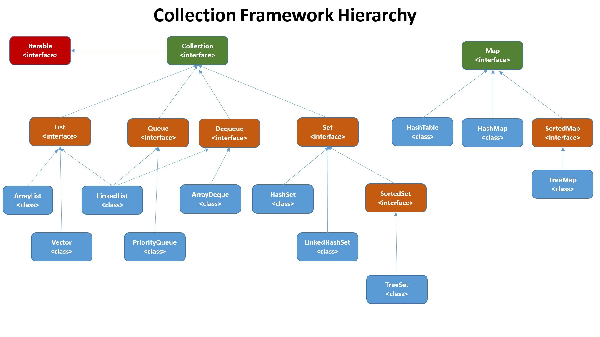

## 集合概述
### Java集合概览
* Java中除了以Map结尾的类之外，其他类都实现了Collection接口，以Map结尾的类都实现了Map接口

### List, Set, Map三者的区别
* List：存储的元素是有序的、可重复的
* Set：存储的元素是无序的、不可重复的
* Map：使用键值对(key-value)存储，key是无序的、不可重复的，value是无序的、可重复的，每个键最多映射到一个值

### List
* ArrayList: Object[]数组
* Vector: Object[]数组
* LinkedList: 双向链表

### Set
* HashSet（无序，唯一）：基于HashMap实现，底层采用HashMap来保存元素‘
* LinkedHashSet：LinkedHashSet是HashSet的子类，并且其内部是通过LinkedHashMap来实现的。
* TreeSet（有序，唯一）：红黑树（自平衡的排序二叉树）

### Map
* HashMap: JDK8之前HashMap由数组+链表组成，数组是HashMap的主体，链表则是主要为了解决哈希冲突而存在的（“拉链法”）。JDK1.8以后再解决哈希冲突时有了较大的变化，当链表长度大于阈值（默认为8）时，将链表转化为红黑树，以减少搜索时间。（将链表转换称红黑树前会判断，如果当前数组的长度小于64，那么会选择先进行数组扩容，而不是转换为红黑树）
* LinkedHashMap：LinkedHashMap继承自HashMap，所以它的底层仍然时基于拉链式散列结构即由数组和链表或红黑树组成。另外，LinkedHashMap在上面结构的基础上，增加了一条双向链表，使得上面的结构可以保持键值对的插入顺序。同时通过对链表进行相应的操作，实现了访问顺序相关逻辑。
* Hashtable：数组+链表组成的，数组是HashMap的主题，链表则是主要为了解决链表则是主要为了解决哈希冲突而存在的
* TreeMap：红黑树（自平衡的排序二叉树）

### ArrayList和Vector的区别
1. ArrayList是List的主要实现类，底层使用Object[]存储，适用于频繁的查找工作，线程不安全。
2. Vector是List的古老实现类，底层使用Object[]存储，线程安全

### ArrayList和LinkedList区别
1. 是否保证线程安全：ArrayList和LinkedList都是不同步的，也就是不保证线程安全
2. 底层数据结构：ArrayList底层使用的是Object数组；LinkedList底层使用的是双向链表数据结构
3. 插入和删除：
    * ArrayList: O(n)
    * LinkedList: O(1)
4. 随机访问
    * ArrayList: O(1)
    * LinkedList: O(n)
5. 内存空间占用
    * ArrayList的空间浪费主要体现在list列表的结尾会预留一定的容量空间
    * LinkedList的空间花费则体现在它的每一个元素都需要消耗比ArrayList更多的空间（因为要存放直接后继和直接前驱以及数据）
