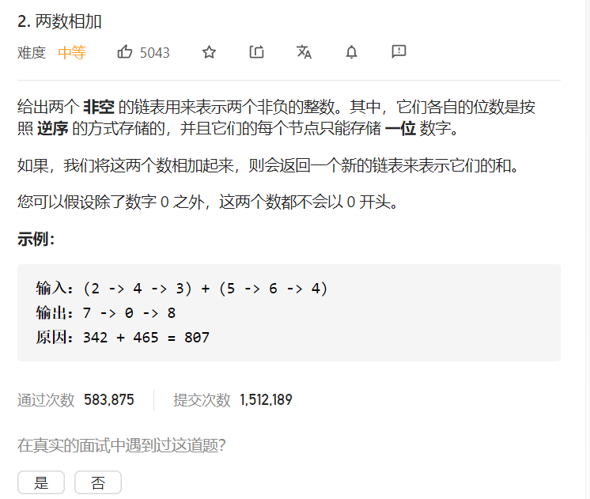

## 思路
创建一个新的链表l3用于存储相加的结果，这里用l3作为头结点，r用作l3遍历指针，用flag表示进位。p, q分别为l1, l2遍历指针。

### 处理进位问题
* flag初始化为0
* 当两数之和加上flag大于10的时候，flag = 1，和减去10
* 当两数之和加上flag不大于10的时候，flag = 0

### 循环
* 当p, q都为null的时候退出循环，**退出后需要注意处理进位问题**
* 如果p为null，则后续只用加q
* 如果q为null，则后续只用加p


```java
/**
 * Definition for singly-linked list.
 * public class ListNode {
 *     int val;
 *     ListNode next;
 *     ListNode() {}
 *     ListNode(int val) { this.val = val; }
 *     ListNode(int val, ListNode next) { this.val = val; this.next = next; }
 * }
 */
class Solution {
    public ListNode addTwoNumbers(ListNode l1, ListNode l2) {
        ListNode p = l1;
        ListNode q = l2;
        ListNode l3 = new ListNode(0);
        ListNode r = l3;
        int flag = 0;
        while (p != null || q != null) {
            int val;
            if (p == null) {
                if (q.val + flag >= 10) {
                    val = q.val + flag - 10;
                    flag = 1;
                } else {
                    val = q.val + flag;
                    flag = 0;
                }
                q = q.next;
            } else if (q == null) {
                if (p.val + flag >= 10) {
                    val = p.val + flag - 10;
                    flag = 1;
                } else {
                    val = p.val + flag;
                    flag = 0;
                }
                p = p.next;
            } else if (p.val + q.val + flag >= 10) {
                val = p.val + q.val + flag - 10;
                flag = 1;
                p = p.next;
                q = q.next;
            } else {
                val = p.val + q.val + flag;
                flag = 0;
                p = p.next;
                q = q.next;
            }
            ListNode node = new ListNode(val);
            r.next = node;
            r = r.next;
        }
        if (flag == 1) {
            ListNode node = new ListNode(1);
            r.next = node;
        }
        return l3.next;
    }
}
```