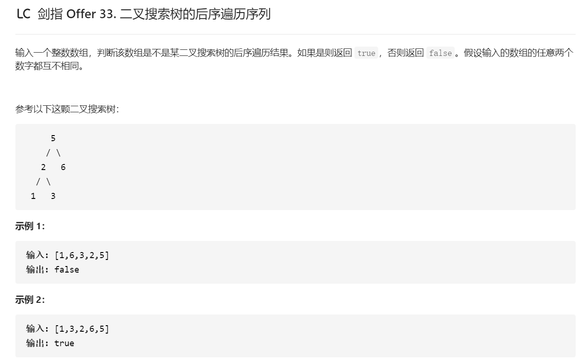
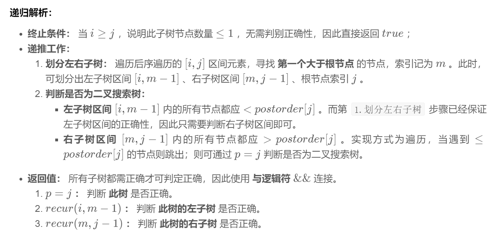

## 递归分治

根据二叉搜索树的定义，可以通过递归，判断所有子树的正确性（即其后序遍历是否满足二叉搜索树的定义），若所有子树都正确，则此序列为二叉搜索树的后序遍历

### 递归解析


```java
class Solution {
    public boolean verifyPostorder(int[] postorder) {
        return recur(postorder, 0, postorder.length - 1);
    }

    public boolean recur(int[] postorder, int i, int j) {
        if (i >= j) return true;
        int p = i;
        while (postorder[p] < postorder[j]) p++;
        int m = p;
        while (postorder[p] > postorder[j]) p++;
        return p == j && recur(postorder, i, m - 1) && recur(postorder, m, j - 1);
    }
}
```