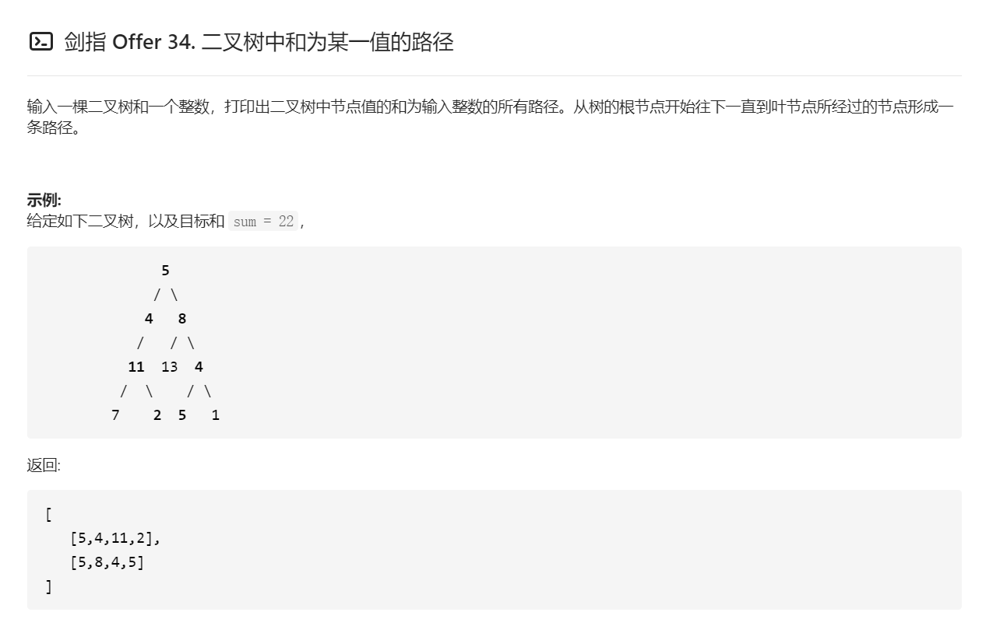

## 解题思路
### 回溯法
* 先序遍历：按照"根、左、右"的顺序，遍历树的所有结点
* 路径记录：在先序遍历中，记录从根结点到当前结点的路径。当路径满足以下两点时，将此路径加入结果列表：
    1. 根结点到叶结点形成的路径
    2. 各结点值的和等于目标值sum


## 算法流程
`pathSum(root, sum)`函数：
* 初始化：结果列表res，路径列表path
* 返回值：返回res

`recur(root, tar)`函数
* 递推参数：当前结点root，当前目标值tar
* 终止条件：当结点root为空，则直接返回
* 递推工作：
    1. 路径更新：将当前结点值root.val加入路径path
    2. 目标值更新：tar - root.val（即目标值tar从sum减至0）
    3. 路径记录：当root为叶结点且路径和等于目标值，则将此路径path加入res
    4. 先序遍历：递归左/右子结点
    5. 路径恢复：向上回溯前，需要将当前结点从路径path中删除

```java
/**
 * Definition for a binary tree node.
 * public class TreeNode {
 *     int val;
 *     TreeNode left;
 *     TreeNode right;
 *     TreeNode(int x) { val = x; }
 * }
 */
class Solution {
    LinkedList<List<Integer>> res = new LinkedList<>();
    LinkedList<Integer> path = new LinkedList<>();
    public List<List<Integer>> pathSum(TreeNode root, int sum) {
        recur(root, sum);
        return res;
    }

    void recur(TreeNode root, int tar) {
        if (root == null) {
            return ;
        }
        path.add(root.val);
        tar -= root.val;
        if (tar == 0 && root.left == null && root.right == null) {
            res.add(new LinkedList(path));
        }
        recur(root.left, tar);
        recur(root.right, tar);
        path.removeLast();
    }

}
```