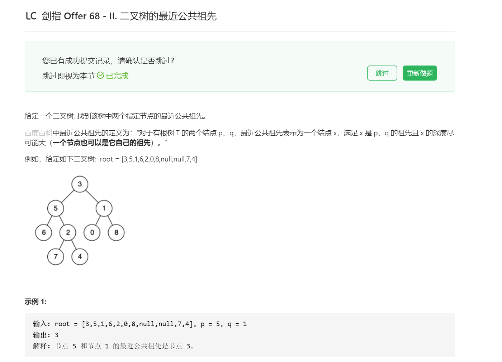

## 解题思路
* 祖先的定义：若结点p在结点root的左（右）子树中，或p = root，则称root是p的祖先
* 最近公共祖先的定义：设结点root为结点p,q的某公共祖先，若其左子结点root.left和右子结点root.right都不是p,q的公共祖先，则称root是“最近的公共祖先”


根据以上定义，若root是p,q的最近公共祖先，则只可能为以下三种情况之一：

1. p和q在root的子树中，且分列root的异侧（即分别在左、右子树中）；
2. p = root且q在root的左或右子树中
3. q = root且p在root的左或右子树中


本题给定了两个重要条件：

1. 二叉搜索树
2. 树的所有结点的值是唯一的

根据以上条件，可方便地判断p, q与root的子树关系，即：

* 若root.val < p.val，则p在root右子树中
* 若root.val > p.val，则p在root左子树中
* 若root.val = p.val，则p和root指向同一节点 

## 迭代
1. 循环搜索：当结点root为空时跳出
    * 当p, q都在root的右子树中，则遍历至root.right
    * 否则，当p, q都在root的左子树中，则遍历至root.left
    * 否则，说明找到了最近公共祖先，跳出
2. 返回值：最近公共祖先root

```java
/**
 * Definition for a binary tree node.
 * public class TreeNode {
 *     int val;
 *     TreeNode left;
 *     TreeNode right;
 *     TreeNode(int x) { val = x; }
 * }
 */
class Solution {
    public TreeNode lowestCommonAncestor(TreeNode root, TreeNode p, TreeNode q) {
        while (root != null) {
            if (p.val < root.val && q.val < root.val) {
                root = root.left;
            } else if (p.val > root.val && q.val > root.val) {
                root = root.right;
            } else {
                break;
            }
        }
        return root;
    }
}
```

## 递归
1. 递推工作
    * 当p, q都在root的右子树中，则开启递归root.right并返回
    * 否则，当p, q都在root的左子树中，则开启递归root.left并返回
2. 返回值
    * 最近公共祖先root

```java
/**
 * Definition for a binary tree node.
 * public class TreeNode {
 *     int val;
 *     TreeNode left;
 *     TreeNode right;
 *     TreeNode(int x) { val = x; }
 * }
 */
class Solution {
    public TreeNode lowestCommonAncestor(TreeNode root, TreeNode p, TreeNode q) {
        if (p.val < root.val && q.val < root.val) {
            return lowestCommonAncestor(root.left, p, q);
        } else if (p.val > root.val && q.val > root.val) {
            return lowestCommonAncestor(root.right, p, q);
        } else {
            return root;
        }
    }
}
```



## 解题思路
考虑通过递归对二叉树进行后序遍历，当遇到结点p或q时返回，从底至顶回溯，当结点p,q在结点root的异侧时，结点root即为最近公共祖先，则向上返回

### 递归解析
1. 终止条件
    1. 当越过叶结点，则直接返回null
    2. 当root等于p,q，则直接返回root
2. 递推工作
    1. 开启递归左子结点，返回值记为left
    2. 开启递归右子结点，返回值记为right
3. 返回值：根据left和right，可展开为四种情况
    1. 当left和right同时为空：说明root的左/右子树中都不包含p, q，返回null
    2. 当left和right同时不为空：说明p,q分别在root的异侧（分别在左/右子树），因此root为最近公共祖先，返回root
    3. 当left为空，right不为空：p, q都不在root的左子树中，直接返回right。具体可分为两种情况：
        1. p, q其中一个在root的右子树中，此时right指向p（假设为p）
        2. p, q两结点都在root的右子树中，此时right指向最近公共祖先结点
    4. 当left不为空，right为空:同3

```java
/**
 * Definition for a binary tree node.
 * public class TreeNode {
 *     int val;
 *     TreeNode left;
 *     TreeNode right;
 *     TreeNode(int x) { val = x; }
 * }
 */
class Solution {
    public TreeNode lowestCommonAncestor(TreeNode root, TreeNode p, TreeNode q) {
        if (root == null || root == p || root == q) return root;
        TreeNode left = lowestCommonAncestor(root.left, p, q);
        TreeNode right = lowestCommonAncestor(root.right, p, q);
        if (left == null && right == null) return null;
        if (left == null) return right;
        if (right == null) return left;
        return root;
    }
}
```

