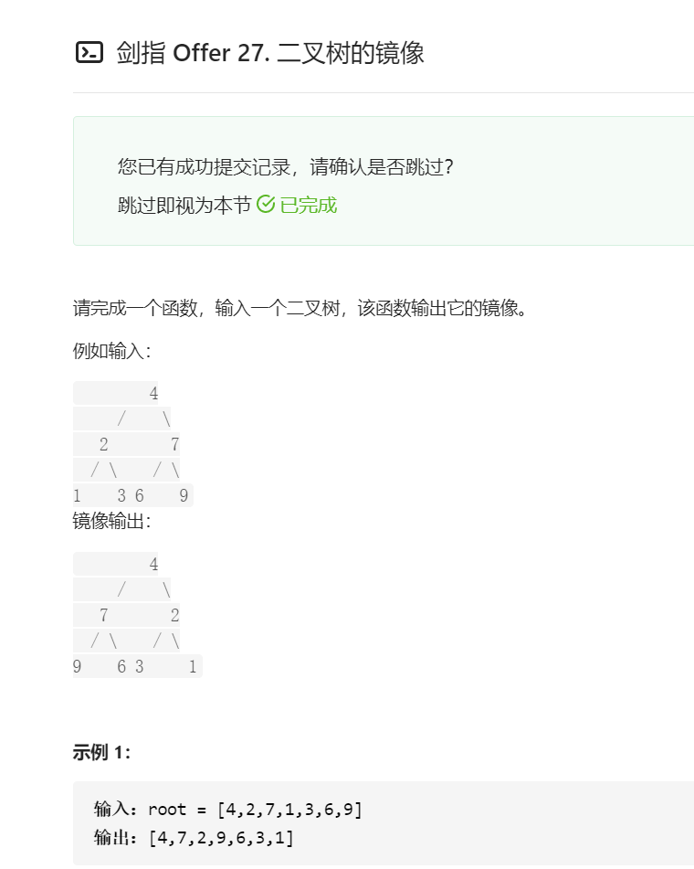

### 二叉树镜像定义
* 对于二叉树中任意结点root，设其左/右子节点分别为left，right；则在二叉树的镜像中对应root结点，其左/右结点分别为right, left

### 递归法
* 终止条件：当结点root为空时，（即越过叶结点），则返回null
* 递推：
    1. 初始化结点tmp, 用于暂存root的左子节点
    2. 开始递归右子节点mirrorTree(root.right)，并将返回值作为root的左子节点
    3. 开始递归左子结点mirrotTree(tmp)，并将返回值作为root的右子结点
* 返回值：返回当前结点root

```java
/**
 * Definition for a binary tree node.
 * public class TreeNode {
 *     int val;
 *     TreeNode left;
 *     TreeNode right;
 *     TreeNode(int x) { val = x; }
 * }
 */
class Solution {
    public TreeNode mirrorTree(TreeNode root) {
        if (root == null) {
            return null;
        }
        TreeNode tmp = root.left;
        root.left = mirrorTree(root.right);
        root.right = mirrorTree(tmp);
        return root;
    }

}

```