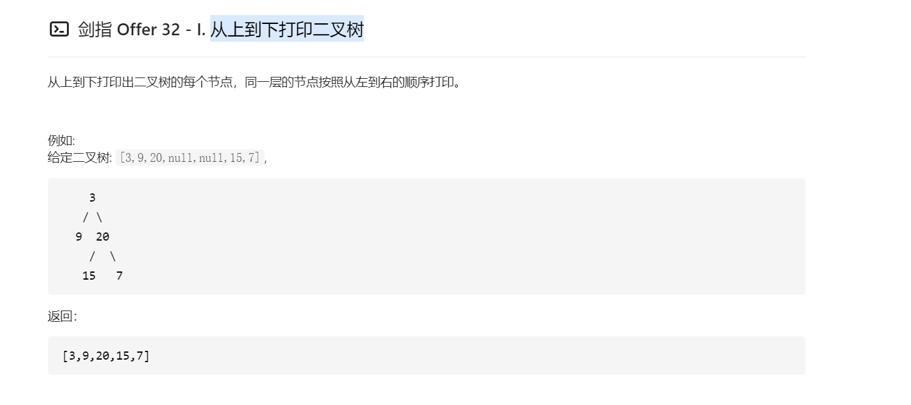
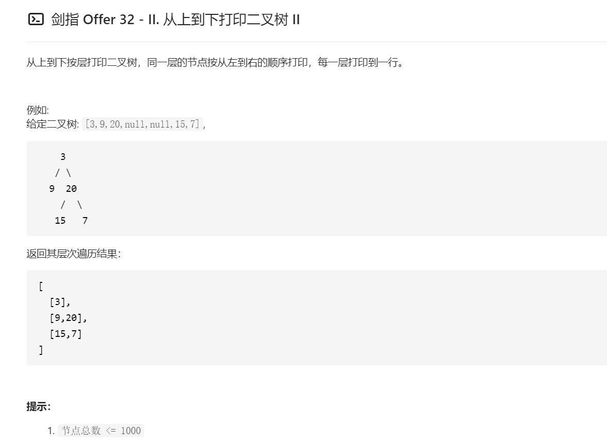
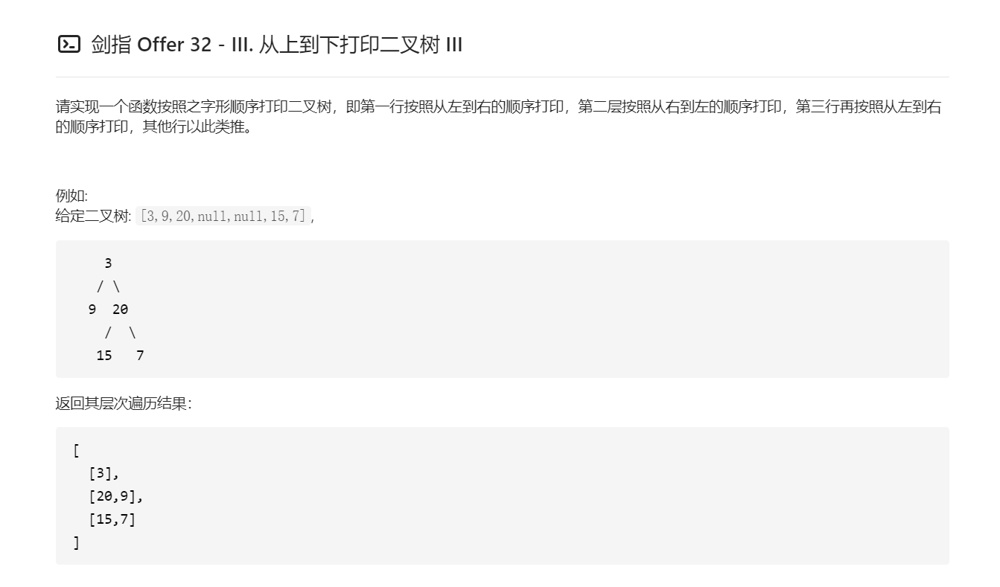

## 算法流程
* 特例处理： 当树的根节点为空，则直接返回空列表 [] ；
* 初始化： 打印结果列表 res = [] ，包含根节点的队列 queue = [root] ；
* BFS 循环： 当队列 queue 为空时跳出；
* 出队： 队首元素出队，记为 node；
* 打印： 将 node.val 添加至列表 tmp 尾部；
* 添加子节点： 若 node 的左（右）子节点不为空，则将左（右）子节点加入队列 queue ；
* 返回值： 返回打印结果列表 res 即可。

```java
/**
 * Definition for a binary tree node.
 * public class TreeNode {
 *     int val;
 *     TreeNode left;
 *     TreeNode right;
 *     TreeNode(int x) { val = x; }
 * }
 */
class Solution {
    public int[] levelOrder(TreeNode root) {
        Queue<TreeNode> queue = new LinkedList<>();
        ArrayList<Integer> res = new ArrayList<>();
        if (root == null) {
            return new int[0];
        }
        queue.offer(root);
        while(!queue.isEmpty()) {
            TreeNode tmp = queue.poll();
            res.add(tmp.val);
            if (tmp.left != null) {
                queue.offer(tmp.left);
            }
            if (tmp.right != null) {
                queue.offer(tmp.right);
            }
        }
        int[] resArray = new int[res.size()];
        for (int i = 0; i < res.size(); i++) {
            resArray[i] = res.get(i);
        }
        return resArray;
    }
}
```



```java
/**
 * Definition for a binary tree node.
 * public class TreeNode {
 *     int val;
 *     TreeNode left;
 *     TreeNode right;
 *     TreeNode(int x) { val = x; }
 * }
 */
class Solution {
    public List<List<Integer>> levelOrder(TreeNode root) {
        Queue<TreeNode> queue = new LinkedList<>();
        List<List<Integer>> res = new ArrayList<>();
        if (root != null) {
            queue.add(root);
        }
        while (!queue.isEmpty()) {
            List<Integer> tmp = new ArrayList<>();
            for (int i = queue.size(); i > 0; i--) {
                TreeNode node = queue.poll();
                tmp.add(node.val);
                if (node.left != null) {
                    queue.offer(node.left);
                }
                if (node.right != null) {
                    queue.offer(node.right);
                } 
            }
            res.add(tmp);
        }
        return res;
    }
}
```



```java
/**
 * Definition for a binary tree node.
 * public class TreeNode {
 *     int val;
 *     TreeNode left;
 *     TreeNode right;
 *     TreeNode(int x) { val = x; }
 * }
 */
class Solution {
    public List<List<Integer>> levelOrder(TreeNode root) {
        Queue<TreeNode> queue = new LinkedList<>();
        List<List<Integer>> res = new ArrayList<>();
        if (root != null) {
            queue.add(root);
        }
        int level = 1;
        while (!queue.isEmpty()) {
            LinkedList<Integer> tmp = new LinkedList<>();
            level++;
            for (int i = queue.size(); i > 0; i--) {
                TreeNode node = queue.poll();
                if (level % 2 == 0) {
                    tmp.addLast(node.val);
                } else {
                    tmp.addFirst(node.val);
                }
                if (node.left != null) {
                    queue.add(node.left);
                }
                if (node.right != null) {
                    queue.add(node.right);
                } 
            }
            res.add(tmp);
        }
        return res;
    }
}
```