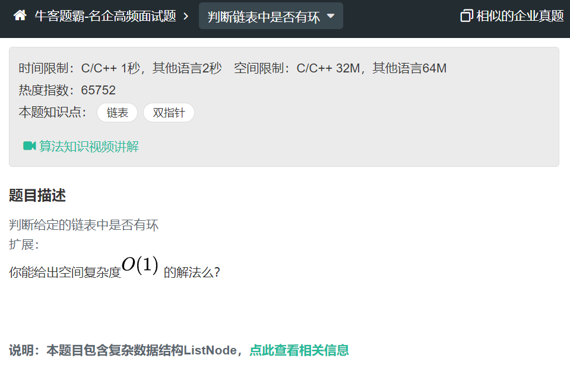

## 思路
### 快慢指针


* 每轮移动之后两者的距离会加一。
* 当一个链表有环时，快慢指针都会陷入环中进行无限次移动，当两个指针都进入环后，每轮移动使得慢指针到快指针的距离加1，同时快指针到慢指针的距离也减少1，只要一直移动下去，快指针总会追上慢指针

```java
/**
 * Definition for singly-linked list.
 * class ListNode {
 *     int val;
 *     ListNode next;
 *     ListNode(int x) {
 *         val = x;
 *         next = null;
 *     }
 * }
 */
public class Solution {
    public boolean hasCycle(ListNode head) {
        if (head == null) {
            return false;
        }
        ListNode fast = head;
        ListNode slow = head;
        while (fast.next != null && fast.next.next != null && slow.next != null) {
            fast = fast.next.next;
            slow = slow.next;
            if (fast == slow) {
                return true;
            }
        }
        return false;
    }
}

```

### 如何判断环的长度呢？
快慢指针相遇后继续移动，直到第二次相遇，两次相遇间移动次数即为环的长度