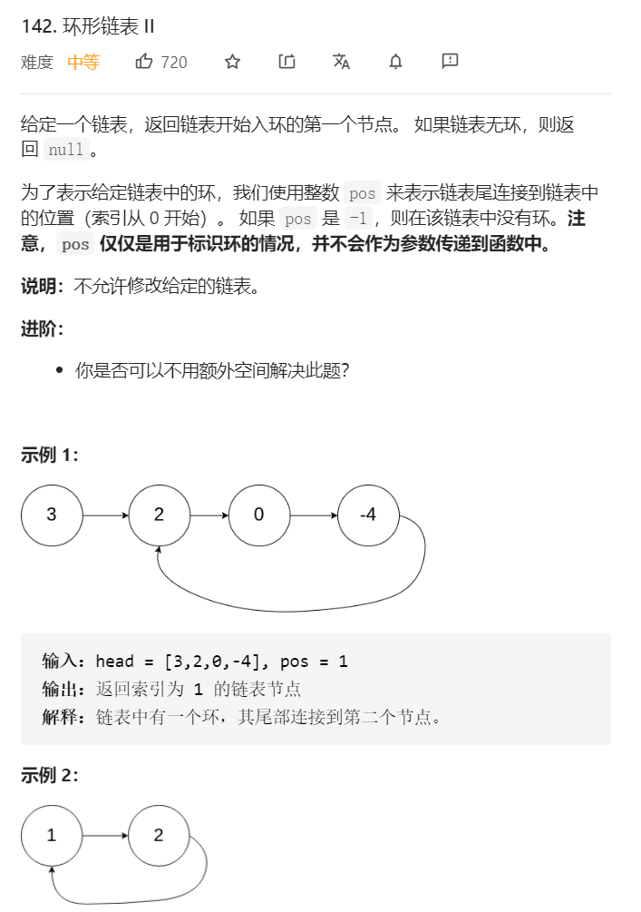

## 解题思路
* 双指针法：快指针fast，慢指针slow，fast每轮走2步，slow每轮走1步

## 算法分析
* 双指针第一次相遇：
    1. 第一种结果：fast指针走过链表末端，说明链表无环，直接返回null
        * 若有环，两指针一定会相遇。因为每走1轮，fast与slow的间距+1，fast一定会追上slow
    2. 第二种结果：当fast == slow时，两指针在环中**第一次相遇**。下面分析此时fast与slow走过的步数关系：
        * 设链表共有a + b个结点，其中**链表头部到链表入口**有a个结点（不计链表入口结点），链表环有b个结点；设两指针分别走了f,s步，则有
        1. fast走的步数是slow步数的2倍，即f = 2s
        2. fast比slow多走了n个环的长度，即f = s + nb
        * 两式相减得：f = 2nb，s = nb，即fast和slow分别走了2n，n个环的周长
* 情况分析
    * 如果让指针从链表头部一直向前走并统计步数k，那么所有 走到链表入口节点时的步数 是：k=a+nb（先走a步到入口节点，之后每绕1圈环（b步）都会再次到入口节点）。
    * 而目前，slow 指针走过的步数为 nb步。因此，我们只要想办法让 slow 再走 a 步停下来，就可以到环的入口。
    * 但是我们不知道a的值，该怎么办？依然是使用双指针法。我们构建一个指针，此指针需要有以下性质：此指针和slow 一起向前走 a 步后，两者在入口节点重合。那么从哪里走到入口节点需要a步？答案是链表头部head。

* 双指针第二次相遇：
    * slow指针**位置不变**，将fast指针重新指向链表头部结点；slow和fast同时每轮向前走一步；
        * 此时f = 0, s = nb
    * 当fast指针走到f = a步时，slow指针走到s = a + nb，此时两指针重合，并同时指向链表环入口
* 返回slow指向的指针结点

```java
/**
 * Definition for singly-linked list.
 * class ListNode {
 *     int val;
 *     ListNode next;
 *     ListNode(int x) {
 *         val = x;
 *         next = null;
 *     }
 * }
 */
public class Solution {
    public ListNode detectCycle(ListNode head) {
        ListNode slow = head;
        ListNode fast = head;
        boolean firstMeet = true;
        while (true) {
            if (fast == null || fast.next == null) return null;
            slow = slow.next;
            fast = fast.next.next;
            if (slow == fast) {
                break;
            }
        }
        fast = head;
        while (slow != fast) {
            slow = slow.next;
            fast = fast.next;
        }
        return slow;
    }
}
```