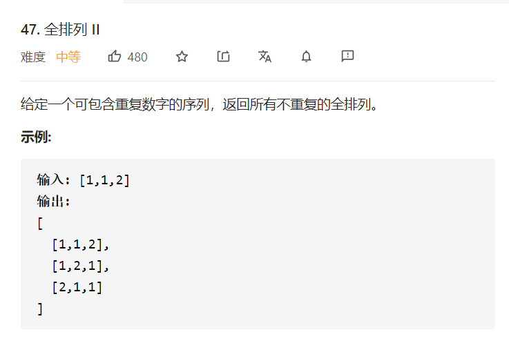

## 思路
在全排列的基础上，增加了序列中元素可重复这一条件，但又要求返回的结果又不能有重复元素。所以我们需要在遍历的过程中一边检测，在一定会产生重复的地方进行剪枝

* 如果要比较两个列表是否一样，可以先对列表分别进行排序，然后再进行逐个比对。所以我们可以在搜索之前就对候选数组进行排序，一旦发现某个分支搜索下去可能搜索到重复的元素就停止搜索，这样结果集中就不会包含重复列表
* 画出树形结构如下：重点想象深度优先遍历在这棵树上执行的过程，哪些地方遍历下去一定会产生重复，这些地方的状态的特点是什么？
对比图中标注 ① 和 ② 的地方。相同点是：这一次搜索的起点和上一次搜索的起点一样。不同点是：

    * 标注 ① 的地方上一次搜索的相同的数刚刚被撤销；
    * 标注 ② 的地方上一次搜索的相同的数刚刚被使用。


所以，在原有基础上需要加上如下剪枝逻辑：
```java
// i > 0保证下标不越界
// nums[i] == nums[i-1]表示这次搜素起点和上一次的一样
// !used[i - 1]表示上一次的刚刚被使用过被撤销，所以会产生重复
if (i > 0 && nums[i] == nums[i - 1] && !used[i - 1]) {
    continue;
}
```

### 完整代码

```java
class Solution {
    public List<List<Integer>> permuteUnique(int[] nums) {
        List<List<Integer>> res = new ArrayList<>();
        List<Integer> path = new ArrayList<>();
        boolean[] used = new boolean[nums.length];
        Arrays.sort(nums);
        dfs(nums, 0, path, used, res);
        return res;
    }

    public void dfs(int[] nums, int depth, List<Integer> path, boolean[] used, List<List<Integer>> res) {
        if (depth == nums.length) {
            res.add(new ArrayList<>(path));
            return;
        }
        for (int i = 0; i < nums.length; i++) {
            if (used[i] || (i > 0 && nums[i] == nums[i - 1] && !used[i - 1])) {
                continue;
            }
            path.add(nums[i]);
            used[i] = true;
            dfs(nums, depth + 1, path, used, res);
            used[i] = false;
            path.remove(path.size() - 1);
        }
    }
}
```