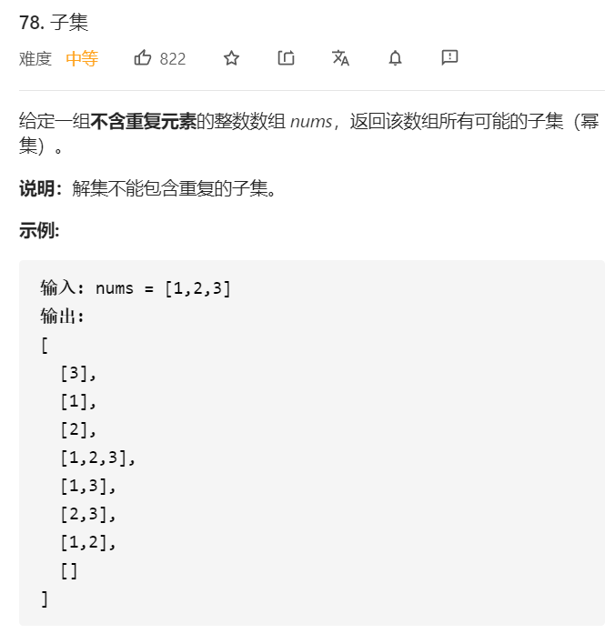

## 思路
* 组合问题，使用begin变量进行搜索控制，**注意begin+1的时候是i+1而不是begin+1**

```java
class Solution {
    public List<List<Integer>> subsets(int[] nums) {
        List<List<Integer>> res = new ArrayList<>();
        List<Integer> path = new ArrayList<>();
        dfs(nums, 0, res, path);
        return res;
    }

    public void dfs(int[] nums, int begin, List<List<Integer>> res, List<Integer> path) {
        res.add(new ArrayList<>(path));
        for (int i = begin; i < nums.length; i++) {
            path.add(nums[i]);
            // 注意是i + 1
            dfs(nums, i + 1, res, path);
            path.remove(path.size() - 1);
        }
    }
}
```