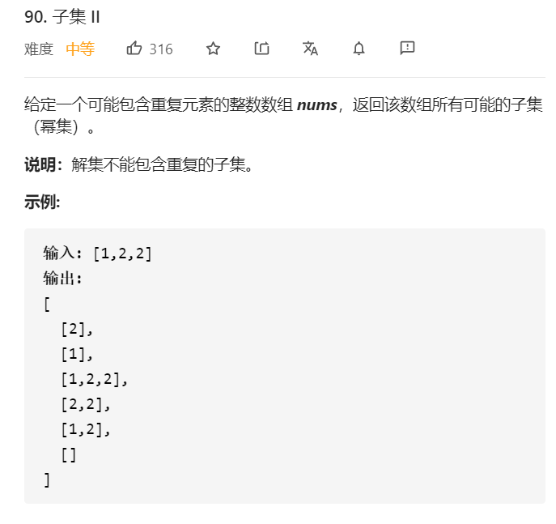

## 思路
* 组合问题，用begin变量进行搜索路径控制，剪枝思路和组合总和2的思路相同，剪去去同一层存在重复的结点的枝。用i > begin来保证是同一层产生的重复。

```java
class Solution {
    public List<List<Integer>> subsetsWithDup(int[] nums) {
        List<List<Integer>> res = new ArrayList<>();
        List<Integer> path = new ArrayList<>();
        Arrays.sort(nums);
        dfs(nums, 0, res, path);
        return res;
    }

    public void dfs(int[] nums, int begin, List<List<Integer>> res, List<Integer> path) {
        res.add(new ArrayList<>(path));
        for (int i = begin; i < nums.length; i++) {
            if (i > begin && nums[i] == nums[i - 1]) continue;
            path.add(nums[i]);
            dfs(nums, i + 1, res, path);
            path.remove(path.size() - 1);
        }

    }


}
```