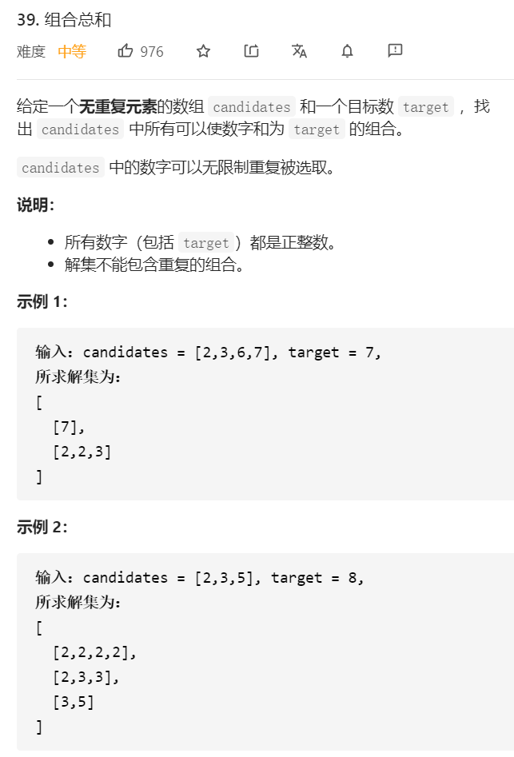

## 回溯法思路
自顶向下，用target依次去减数组中的元素，如果最后结果为0，则说明这条路径是其中一个解。

树形图如下：


* 以 target = 7 为 根结点 ，创建一个分支的时 做减法 ；
* 每一个箭头表示：从父亲结点的数值减去边上的数值，得到孩子结点的数值。边的值就是题目中给出的 candidate 数组的每个元素的值；
* 减到 0 或者负数的时候停止，即：结点 0 和负数结点成为叶子结点；
* 所有从根结点到结点 0 的路径（只能从上往下，没有回路）就是题目要找的一个结果。


这棵树有 44 个叶子结点的值 00，对应的路径列表是 [[2, 2, 3], [2, 3, 2], [3, 2, 2], [7]]，而示例中给出的输出只有 [[7], [2, 2, 3]]。即：题目中要求每一个符合要求的解是 不计算顺序 的。

## 产生重复路径的原因以及解决
* 原因：在每一个结点做减法，展开分支的时候，由于每一个元素都重复利用，我们考虑了所有的候选数，因此出现了重复的列表
* 解决方法：遇到这一类相同元素不计算顺序的问题，我们在搜索的时候就需要按某种顺序搜索。具体的做法是：每一次搜索的时候设置下一轮搜索的起点begin，即：从每一层的第2个结点开始，都不能再搜索产生同一层结点已经使用过的candidate里的元素


```java
class Solution {
    public List<List<Integer>> combinationSum(int[] candidates, int target) {
        List<Integer> path = new ArrayList<Integer>();
        List<List<Integer>> res = new ArrayList<>();
        dfs(candidates, target, 0, path, res);
        return res;
    }

    public void dfs(int[] candidates, int target, int begin, List<Integer> path, List<List<Integer>> res) {
        if (target < 0) {
            return;
        }
        if (target == 0) {
            res.add(new ArrayList<>(path));
            return;
        }
        // 从begin开始搜索
        for (int i = begin; i < candidates.length; i++) {
            target -= candidates[i];
            path.add(candidates[i]);
            // 由于每一个元素都可以重复利用，所以下一层的搜索起点仍然是i
            dfs(candidates, target, i, path, res);
            path.remove(path.size() - 1);
            target += candidates[i];
        }
    }
}

```

## 总结什么时候用used数组，什么时候用begin变量
* 排列问题：讲究顺序([2, 2, 3]与[2, 3, 2]视为不同列表时)，需要记录哪些数字已经使用过，此时使用used数组
* 组合问题，不讲究顺序(即[2, 2, 3]与[2, 3, 2]视为相同列表时)，需要按照某种顺序搜索，此时使用begin变量


