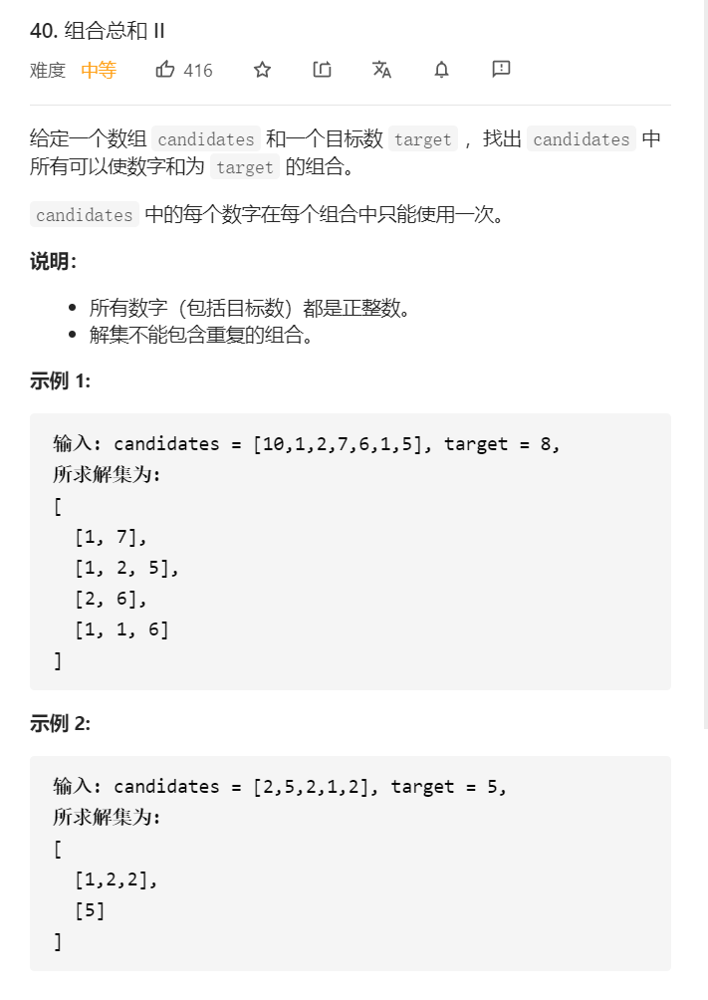
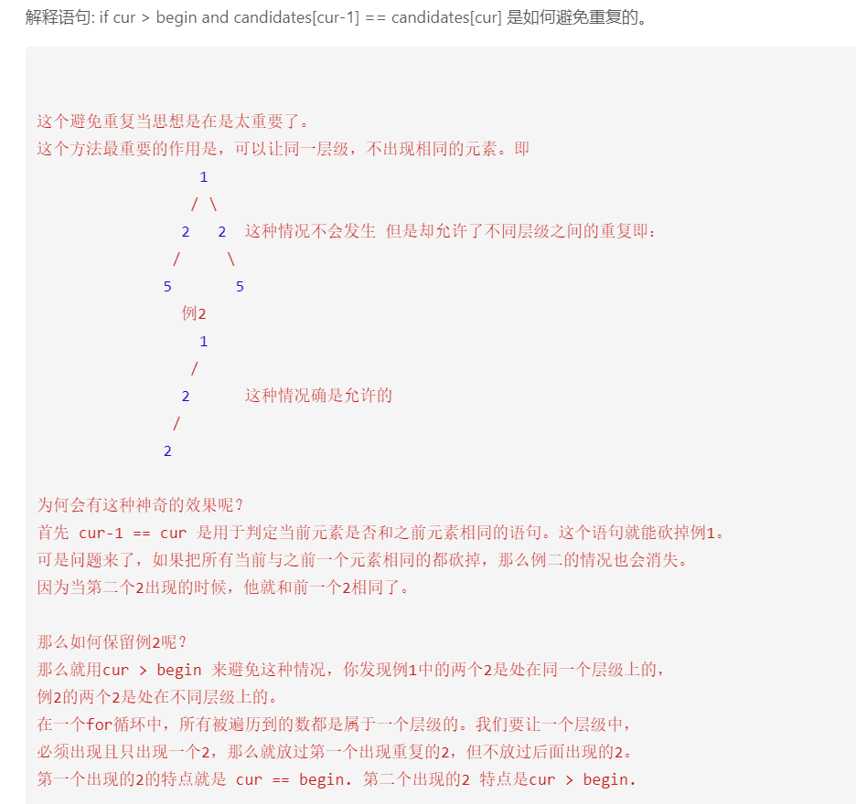

## 思路
* 去掉一个数组中重复的元素：先对数组升序排序，重复的元素一定不是排好序以后相同的连续数组区域的第一个元素。也就是说，剪枝发生在：**同一层数组相同的结点第2、3...个结点，因为数值相同的第1个结点已经搜索出了包含了这个数值的全部结果**，同一层的其他结点，候选数的个数更少，搜索出的结果一定不会比第1个结点更多，并且是第一个结点的子集。



* 发生回溯才会有i > begin


```java
class Solution {
    public List<List<Integer>> combinationSum2(int[] candidates, int target) {
        Arrays.sort(candidates);
        List<List<Integer>> res = new ArrayList<>();
        List<Integer> path = new ArrayList<>();
        dfs(candidates, target, 0, path, res);
        return res;
    }
    
    public void dfs(int[] candidates, int target, int begin, List<Integer> path, List<List<Integer>> res) {
        if (target == 0) {
            res.add(new ArrayList<>(path));
            return;
        }
        for (int i = begin; i < candidates.length; i++) {
            // 大剪枝，由于数组已经升序排序，如果target - candidates[i] < 0, 则减后面的元素也一定小于0
            if (target - candidates[i] < 0) {
                break;
            }
            // 小剪枝，如果出现同一层相同的情况，减去（i > begin保证是同一层的）
            if (i > begin && candidates[i] == candidates[i -1]) {
                continue;
            }
            path.add(candidates[i]);
            // 每个元素都只能用一次，所以i要+1
            dfs(candidates, target - candidates[i], i + 1, path, res);
            path.remove(path.size() - 1);
        }
    }
}
```