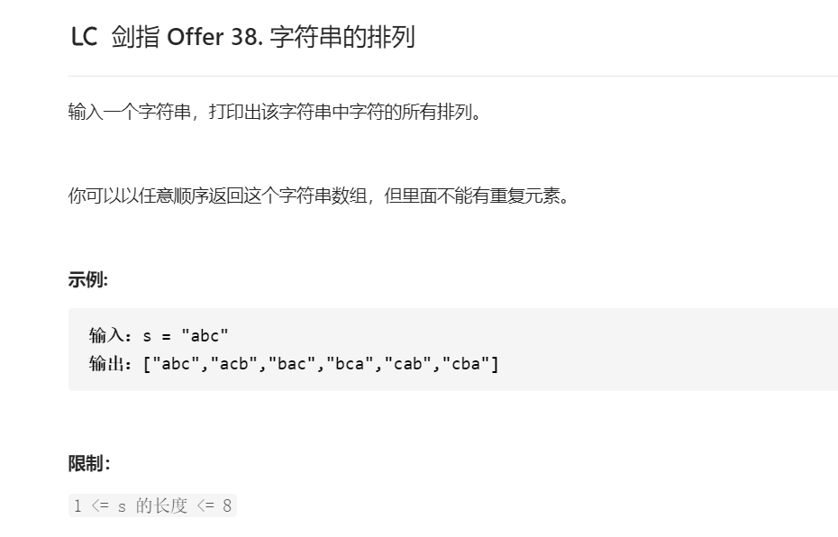

## 解题思路

### 排列方案的生成
根据字符串排列的特点，考虑深度优先搜索所有排列方案。即通过字符交换，先固定第1位字符(n种情况)，再固定第2位字符(n - 1种情况)、...、最后固定第n位字符（1种情况）

### 重复排列方案与剪枝
* 剪枝： 当字符串存在重复字符时，排列方案也存在重复的排列方案。为排除重复方案，需在固定某位字符时，保证“每种字符只在此位固定一次”，即遇到重复字符时不交换，直接跳过。

### 递归解析
1. 终止条件：当x = len(c) - 1时，代表所有位已固定（最后一位只有1种情况），则将当前组合c转化为字符串并加入res，并返回
2. 递推参数：当前固定位x
3. 递推工作：初始化一个Set，用于排除重复的字符；将第x位字符与i字符分别交换，并进入下层递归
    1. 剪枝：若c[i]在Set中，代表其是重复字符，因此“剪枝”
    2. 将c[i]加入Set，以便之后遇到重复字符时剪枝
    3. 固定字符：将字符c[i]和c[x]交换，即固定c[i]为当前位字符
    4. 开启下层递归：调用dfs(x + 1)，即开始固定第x+1个字符
    5. 还原交换：将字符c[i]和c[x]交换
    