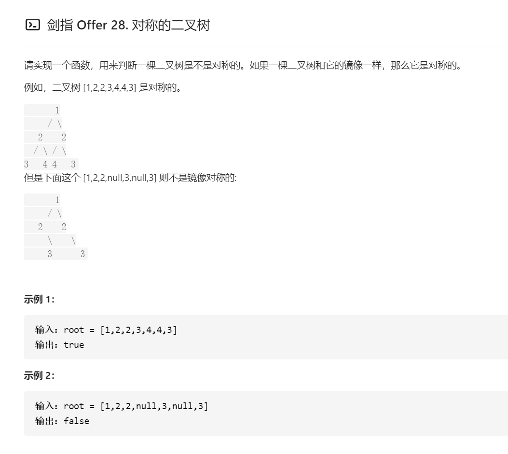

## 解题思路
对称二叉树定义：对于树种任意两个对称结点L和R，一定有
* L.val = R.val
* L.left.val = R.right.val
* L.right.val = L.left.val


## 算法流程
### isSymmetric(root)
* 特例处理：若根结点root为空，则直接返回true
* 返回值：即recur(root.left, root.right)

### recur(L, R)
* 终止条件：
    * 当L和R同时越过叶结点：此树从顶至底的结点都对称，返回true
    * 当L或R中只有一个越过叶结点，此树不对称，返回false
    * 当L.val != R.val：此树不对称，返回false
* 递推工作：
    * 判断两结点L.left和R.right是否对称，即recur(L.left, R.right);
    * 判断两结点L.right和R.left是否对称，即recur(L.right, R.left);
* 返回值：左右结点都对称时，整棵树才对称，用逻辑符&&连接

```java
/**
 * Definition for a binary tree node.
 * public class TreeNode {
 *     int val;
 *     TreeNode left;
 *     TreeNode right;
 *     TreeNode(int x) { val = x; }
 * }
 */
class Solution {
    public boolean isSymmetric(TreeNode root) {
        if (root == null) {
            return true;
        }
        return recur(root.left, root.right);
    }

    public boolean recur(TreeNode L, TreeNode R) {
        if (L == null && R == null) {
            return true;
        }
        if ((L == null && R != null) || (L != null && R == null)) {
            return false;
        }
        if (L.val != R.val) {
            return false;
        }
        return recur(L.left, R.right) && recur(L.right, R.left);
    }
}
```